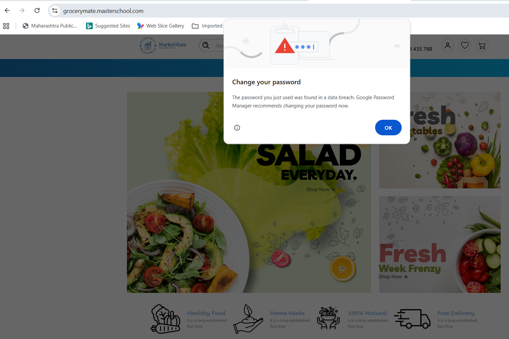
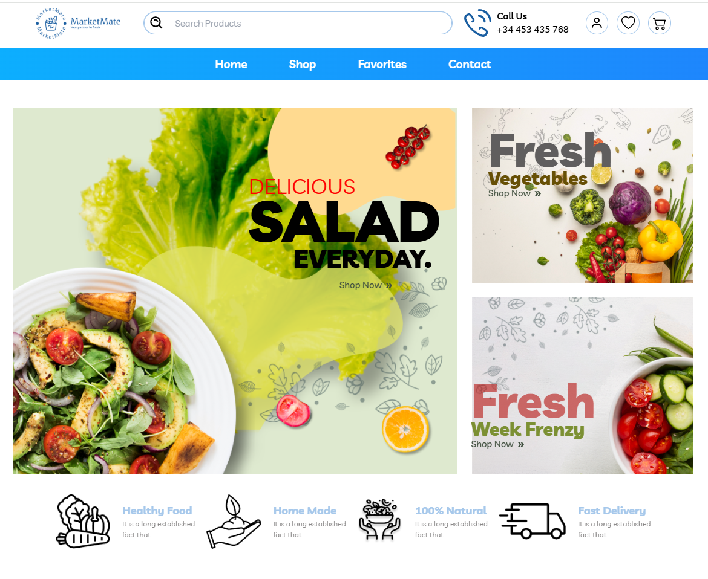
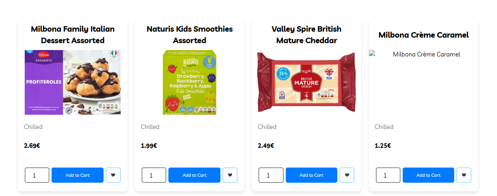
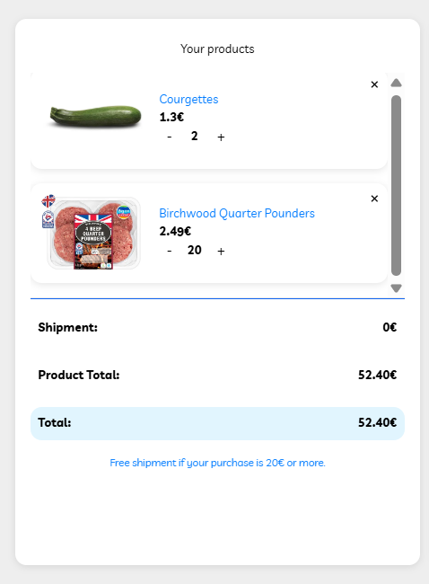
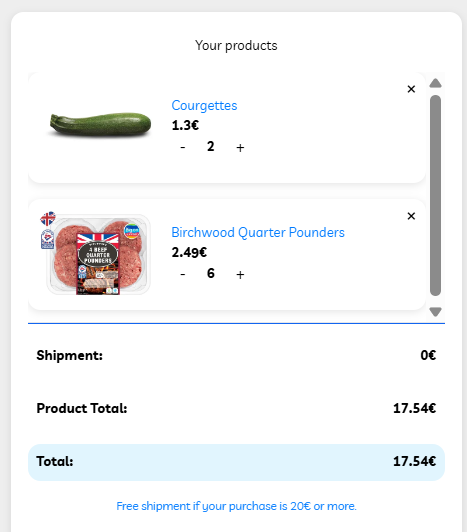
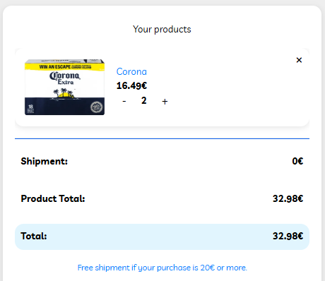

# Test Reporting — GroceryMate Webshop (New Features)

**System Under Test:** https://grocerymate.masterschool.com  
**Tested By:** QA Engineer  
**Test Date:** 2026-01-19  

---

## Scenario 1: Valid Age Verification for Alcoholic Products

As a user of GroceryMate, I am able to access alcoholic products when I am 18 years old.

| Step# | Action | Expected Outcome | OK/NOK | URL | Link to Issue |
|---|---|---|---|---|---|
| 1 | Open GroceryMate homepage | Homepage loads successfully | OK | / | |
| 2 | Navigate to Alcohol category | Age verification modal appears | OK | /alcohol | |
| 3 | Enter DOB resulting in age = 18 | Input accepted | OK | /alcohol | |
| 4 | Submit age verification | Access granted to alcohol products | OK | /alcohol | |

**Evidence:** Screenshot 01

---

## Scenario 2: Invalid Age Verification (Underage User)

As a user of GroceryMate, I am not able to access alcoholic products when I am under 18 years old.

| Step# | Action | Expected Outcome | OK/NOK | URL | Link to Issue |
|---|---|---|---|---|---|
| 1 | Navigate to Alcohol category | Age verification modal appears | OK | /alcohol | |
| 2 | Enter DOB resulting in age = 17 | Input accepted | OK | /alcohol | |
| 3 | Submit age verification | Access denied with error message | NOK | /alcohol | Issue #10 |

**Evidence:** Screenshot 02

---

## Scenario 3: Alcohol Product Accessible via Direct URL

As a user, I should not be able to bypass age verification using a direct product URL.

| Step# | Action | Expected Outcome | OK/NOK | URL | Link to Issue |
|---|---|---|---|---|---|
| 1 | Open alcoholic product URL directly | Access blocked or verification shown | NOK | /product/alcohol-01 | Issue #10 |

**Evidence:** Screenshot 03

---

## Scenario 4: Weak Password Validation During Signup

As a user, I should not be able to register with a weak password.

| Step# | Action | Expected Outcome | OK/NOK | URL | Link to Issue |
|---|---|---|---|---|---|
| 1 | Navigate to signup page | Signup page displayed | OK | /signup | |
| 2 | Enter weak password (e.g., 12345) | Password rejected | NOK | /signup | Issue #1 |
| 3 | Submit signup form | Error message displayed | NOK | /signup | Issue #1 |

**Evidence:** Screenshot 04

---

## Scenario 5: Shop Now CTA on Homepage

As a user, I expect the “Shop Now” button to navigate me to the product catalog.

| Step# | Action | Expected Outcome | OK/NOK | URL | Link to Issue |
|---|---|---|---|---|---|
| 1 | Open homepage | Homepage loads | OK | / | |
| 2 | Click “Shop Now” CTA | User navigated to catalog | NOK | / | Issue #2 |

**Evidence:** Screenshot 05

---

## Scenario 6: Incorrect Product Category Classification (Fruits/Vegetables)

As a user, I expect products to appear under the correct category.

| Step# | Action | Expected Outcome | OK/NOK | URL | Link to Issue |
|---|---|---|---|---|---|
| 1 | Navigate to Vegetables category | Only vegetable products shown | NOK | /category/vegetables | Issue #4 |

**Evidence:** Screenshot 06

---

## Scenario 7: Missing Product Image in Listing

As a user, I expect all products to display an image.

| Step# | Action | Expected Outcome | OK/NOK | URL | Link to Issue |
|---|---|---|---|---|---|
| 1 | Open product listing page | All products display images | NOK | /catalog | Issue #5 |

**Evidence:** Screenshot 07

---

## Scenario 8: Incorrect Category for Meat & Poultry Products

As a user, I expect meat products to be listed under the correct category.

| Step# | Action | Expected Outcome | OK/NOK | URL | Link to Issue |
|---|---|---|---|---|---|
| 1 | Navigate to Fresh Vegetables category | No meat products shown | NOK | /category/vegetables | Issue #6 |

**Evidence:** Screenshot 08

---

## Scenario 9: Shipping Cost Below Free-Shipping Threshold

As a user, I expect a shipping fee when my cart total is below the free-shipping threshold.

| Step# | Action | Expected Outcome | OK/NOK | URL | Link to Issue |
|---|---|---|---|---|---|
| 1 | Add low-priced item to cart | Item added successfully | OK | /cart | |
| 2 | Verify shipping cost | Shipping fee applied | NOK | /cart | Issue #7 |

**Evidence:** Screenshot 09

---

## Scenario 10: Incorrect Free-Shipping Message Display

As a user, I should see the free-shipping message only when conditions are met.

| Step# | Action | Expected Outcome | OK/NOK | URL | Link to Issue |
|---|---|---|---|---|---|
| 1 | Add items below threshold | Free-shipping message hidden | NOK | /cart | Issue #9 |

**Evidence:** Screenshot 10

---

## Scenario 11: Search Results Incomplete

As a user, I expect search results to display all matching products.

| Step# | Action | Expected Outcome | OK/NOK | URL | Link to Issue |
|---|---|---|---|---|---|
| 1 | Search for category keyword | All relevant products displayed | NOK | /search | Issue #11 |

**Evidence:** Screenshot 11

---

## Overall Test Execution Result

**Status:** ❌ FAIL  

**Reason:**
- Security violations (age verification, password validation)
- Incorrect pricing and shipping behavior
- Multiple UI and data classification issues

---

## Test Evidence

### Screenshot 01 – Strong Password Validation

### Screenshot 02 – Shop Now CTA Not Working

### Screenshot 03 – Pricing Issue (Items above €20 still shown)

### Screenshot 04 – Fruits Listed Under Vegetables

### Screenshot 05 – Missing Product Image

### Screenshot 06 – Meat & Poultry Listed Under Vegetables

### Screenshot 07 – Shipping Charge Incorrect (0)

### Screenshot 08 – CVV Displayed (Security Issue)

### Screenshot 09 – Free Shipping Message Incorrect

### Screenshot 10 – Age Verification Bypass During Purchase

### Screenshot 11 – Search Results Incomplete

---

**End of Test Report**
